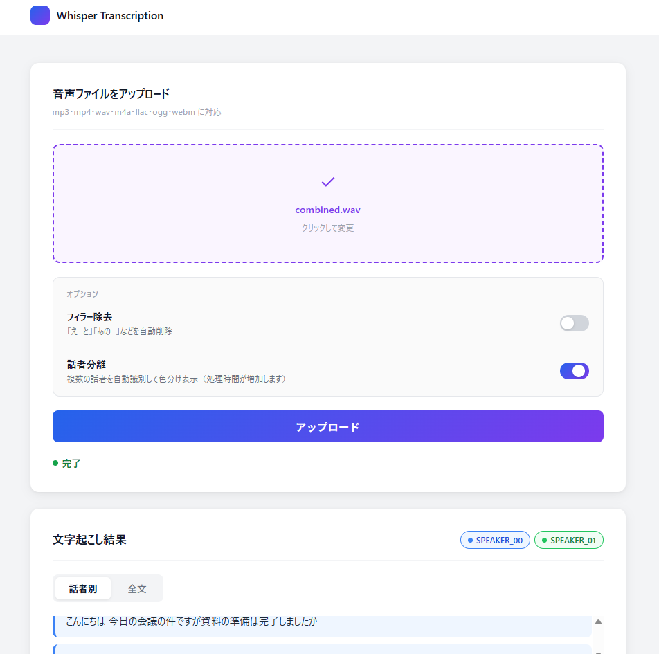
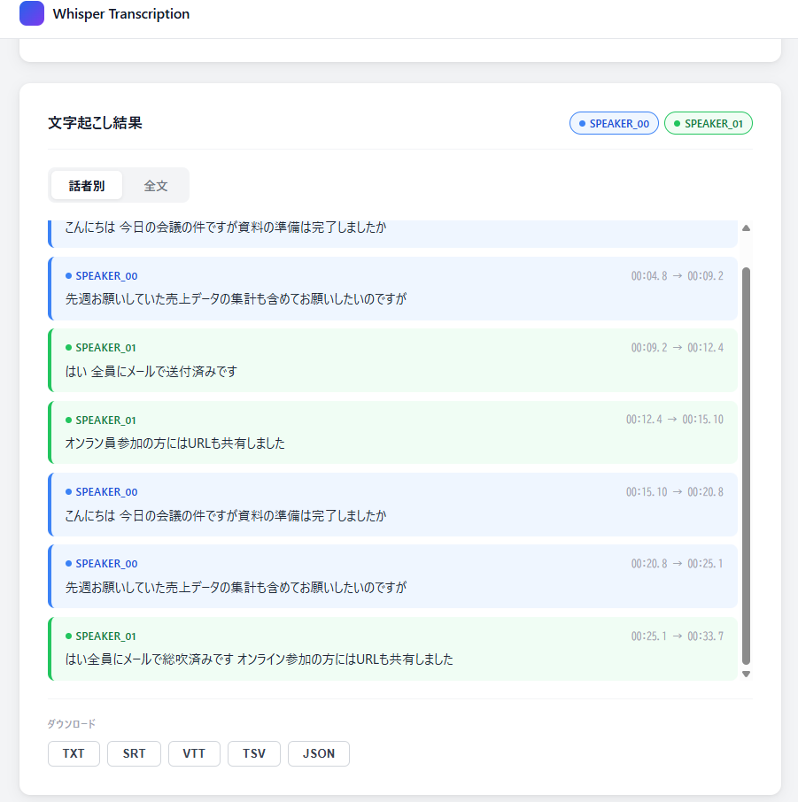

# whisper-transcription-app

OpenAI Whisperを使った音声文字起こしWebアプリ。  
FastAPI + React + Docker で構成し、話者分離・フィラー除去・複数形式ダウンロードに対応。

## スクリーンショット




## 機能

- 音声・動画ファイルのアップロード（mp3 / mp4 / wav / m4a / flac / ogg / webm）
- Whisperによる日本語文字起こし（GPU / CPU 自動切り替え）
- 話者分離（pyannote.audio）による複数話者の自動識別・色分け表示
- フィラー除去（「えーと」「あのー」などを自動削除）
- 複数形式ダウンロード（TXT / SRT / VTT / TSV / JSON）
- GitHub Actions による CI（pytest 5テスト全通過）

## デモについて

WhisperはCPU/GPUリソースを大量に使用するため、無料のクラウドサーバーでは  
タイムアウトが発生し安定稼働が困難です。  
そのため動作確認はローカル環境での起動をご参照ください。

## 技術スタック

| カテゴリ | 使用技術 |
|---|---|
| バックエンド | Python / FastAPI / OpenAI Whisper / pyannote.audio |
| フロントエンド | React / Vite |
| インフラ | Docker / Docker Compose |
| CI | GitHub Actions / pytest |

## 起動手順

### 必要なもの

- Docker / Docker Compose
- （Windowsの場合）Docker Desktop
- HuggingFace アクセストークン（話者分離に必要）

### 環境変数の設定

`.env.example` をコピーして `.env` を作成し、HuggingFaceトークンを設定してください。

```bash
cp .env.example .env
```

`.env` の中身：

```
HUGGINGFACE_TOKEN=your_token_here
```

HuggingFaceトークンは [huggingface.co](https://huggingface.co/settings/tokens) で取得できます。  
また、以下のモデルへのアクセス許可が必要です：
- [pyannote/speaker-diarization-3.1](https://huggingface.co/pyannote/speaker-diarization-3.1)

### 起動

```bash
git clone https://github.com/Nishimura-Jin/whisper-transcription-app.git
cd whisper-transcription-app
docker compose up --build
```

起動後、以下のURLにアクセスしてください：

- フロントエンド: http://localhost:5173
- APIドキュメント: http://localhost:8000/docs

### 基本的な使い方

1. ブラウザで http://localhost:5173 を開く
2. 音声・動画ファイルをアップロード
3. 話者分離を使用する場合はトグルをONにする
4. 文字起こし完了後、タブ切替で話者ごとの結果を確認
5. 任意の形式でダウンロード